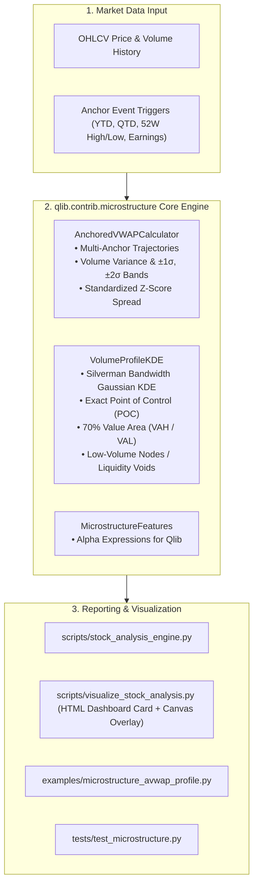

# Implementation Plan: Anchored VWAP (AVWAP) & Volume Profile (KDE) Engine

## End-User Alignment & Printed Acknowledgement

> [!IMPORTANT]
> **Priority -1 Printed Acknowledgement of End-User Requirements**:  
> We explicitly acknowledge and prioritize the dual mandates of our project end-users:
> 1. **The Profitable Stock Trader**: Demands frontline execution reality—recognizing that prices move between institutional liquidity nodes and benchmark execution averages. Requires multi-anchor VWAPs (YTD, QTD, 52W High/Low, earnings) and volume-at-price envelopes (POC, Value Area) to eliminate sterile daily-bar assumptions and trade with institutional order flow.
> 2. **The Institutional Hedge Fund Manager**: Requires mathematical formalization and statistical rigor. Replaces discrete, arbitrary histogram binning with continuous **Volume-Weighted Kernel Density Estimation (KDE)**, enforces volume-weighted standard deviation dispersion bands ($\pm 1\sigma, \pm 2\sigma$), and derives continuous alpha features ($Z$-score spreads and liquidity void indicators) suitable for systematic cross-sectional modeling.

---

## Problem Statement & Context

In Microsoft Qlib, volume is historically treated as a crude daily scalar (`$volume`). In actual equity markets:
1. **Institutional Memory Clustered at Anchors**: Institutional execution algorithms (VWAP, TWAP, Percentage of Volume) benchmark execution against specific macro inflection points (e.g. start of year, cyclical extremes, or earnings gap dates). When price retests an Anchored VWAP, large institutional orders activate as support/resistance.
2. **Discrete Price Bars Miss Volume Distribution**: Traditional technical indicators treat closing price as a single point, ignoring where within the price range institutional transactions actually accumulated.
3. **Discrete Volume Profile Heuristics**: Retail volume profile tools rely on arbitrary histogram bin sizes. Institutional quantitative finance requires smooth, continuous **Gaussian Kernel Density Estimation (KDE)** to identify exact **High-Volume Nodes (HVN / Point of Control)** and **Low-Volume Nodes (LVN / Liquidity Voids)**.

This plan specifies the complete design, mathematical formulations, and implementation of `qlib.contrib.microstructure` covering **Multi-Anchor VWAP** and **Continuous Kernel Density Volume Profiling**.

---

## User Review Required

> [!IMPORTANT]
> **Anchor Detection Autonomy**: The `AnchoredVWAP` engine will automatically compute standard calendar anchors (YTD, QTD) and rolling cyclical anchors (52-week High, 52-week Low, and local swing extremes) directly from the available price history without requiring external calendar files. If an earnings calendar is provided, it seamlessly incorporates post-earnings announcement anchors.

> [!TIP]
> **Zero External Dependency Guarantee**: Following our proven architecture in `qlib.contrib.regime`, all Gaussian Kernel Density Estimation and volume dispersion band algorithms will be implemented in pure, vectorized NumPy and SciPy/standard library math, ensuring compatibility with any Python installation.

---

## Open Questions

1. **Default Canvas Chart Overlay**: Should the interactive HTML report (`visualize_stock_analysis.py`) overlay the **YTD Anchored VWAP** and its $\pm 1\sigma$ dispersion bands directly onto the primary interactive price chart alongside the existing 50/200 SMAs? *(Default proposed: Yes, rendered with dedicated toggle buttons so the user can show/hide them)*.
2. **Volume Profile Lookback Default**: For the continuous KDE Volume Profile, we propose a rolling 63-trading-day (~1 quarter) lookback window for the primary Point of Control (POC). Would you also like a full-dataset (Max) option? *(Default proposed: Both 63-day rolling and Full-History profile supported)*.

---

## Proposed Changes



---

### Component 1: Institutional Microstructure Package (`qlib/contrib/microstructure/`)

#### [NEW] [anchored_vwap.py](file:///e:/SRC/GITHUB/my-qlib/qlib/contrib/microstructure/anchored_vwap.py)
* **Mathematical Formulations**:
  - Typical Price per bar:
    $$P_\tau = \frac{\text{High}_\tau + \text{Low}_\tau + \text{Close}_\tau}{3}$$
  - Anchored VWAP from anchor date $t_0$:
    $$\text{AVWAP}_{t_0, t} = \frac{\sum_{\tau=t_0}^t P_\tau \cdot V_\tau}{\sum_{\tau=t_0}^t V_\tau}$$
  - Volume-Weighted Dispersion Variance:
    $$\sigma_{\text{AVWAP}, t}^2 = \frac{\sum_{\tau=t_0}^t V_\tau \cdot (P_\tau - \text{AVWAP}_{t_0, t})^2}{\sum_{\tau=t_0}^t V_\tau}$$
  - Standard Deviation Bands:
    $$\text{UpperBand}_{k, t} = \text{AVWAP}_{t_0, t} + k \cdot \sigma_{\text{AVWAP}, t}, \quad \text{LowerBand}_{k, t} = \text{AVWAP}_{t_0, t} - k \cdot \sigma_{\text{AVWAP}, t}$$
  - Standardized Price Spread ($Z$-Score):
    $$Z_{\text{AVWAP}, t} = \frac{P_t - \text{AVWAP}_{t_0, t}}{\sigma_{\text{AVWAP}, t}}$$
* **Anchor Detection Subroutines**:
  - `ytd`: Evaluates first trading session of current year.
  - `qtd`: Evaluates first trading session of current quarter.
  - `high_52w`: Identifies date of rolling 252-day peak.
  - `low_52w`: Identifies date of rolling 252-day trough.
  - `custom`: Arbitrary date string `YYYY-MM-DD`.

#### [NEW] [volume_profile.py](file:///e:/SRC/GITHUB/my-qlib/qlib/contrib/microstructure/volume_profile.py)
* **Mathematical Formulations**:
  - Continuous Volume-Weighted Gaussian Kernel Density Estimation:
    $$\hat{f}(p) = \frac{1}{\sum_{i=1}^N V_i} \sum_{i=1}^N V_i \cdot \frac{1}{h \sqrt{2\pi}} \exp\left(-\frac{1}{2}\left(\frac{p - P_i}{h}\right)^2\right)$$
  - Optimal Bandwidth via Silverman's Rule of Thumb with volume-weighted dispersion:
    $$h = 1.06 \cdot \sigma_V \cdot N^{-1/5}$$
  - **Point of Control (POC)**:
    $$\text{POC} = \arg\max_p \hat{f}(p)$$
  - **Value Area Envelope (VAH & VAL)**: The highest-density price range containing $70\%$ of the total cumulative volume distribution:
    $$\int_{\text{VAL}}^{\text{VAH}} \hat{f}(p) \, dp = 0.70$$
  - **Liquidity Voids / Low-Volume Nodes (LVN)**: Regions where $\hat{f}(p)$ drops below the 15th percentile of the active range density. Triggers high-velocity traversal flags.

#### [NEW] [__init__.py](file:///e:/SRC/GITHUB/my-qlib/qlib/contrib/microstructure/__init__.py)
* Clean package initialization exposing `AnchoredVWAPCalculator`, `VolumeProfileKDE`, and `compute_microstructure_features`.

---

### Component 2: Integration into Stock Analysis & HTML Dashboards

#### [MODIFY] [stock_analysis_engine.py](file:///e:/SRC/GITHUB/my-qlib/scripts/stock_analysis_engine.py)
* Add [`compute_microstructure_features()`](file:///e:/SRC/GITHUB/my-qlib/scripts/stock_analysis_engine.py):
  - Computes YTD AVWAP, 52W High AVWAP, 52W Low AVWAP, POC, VAH, VAL, and Liquidity Void flags.
  - Enhances `predict_future_buy_timing`: Aligns optimal buy entry zones with institutional AVWAP support and POC high-volume nodes.
  - Appends microstructure summary dictionary into `run_stock_analysis` return payload.

#### [MODIFY] [visualize_stock_analysis.py](file:///e:/SRC/GITHUB/my-qlib/scripts/visualize_stock_analysis.py)
* Add **Institutional Liquidity & Anchored VWAP Dashboard Card**:
  - YTD AVWAP level and price deviation $Z$-score.
  - 52-Week High & Low anchor trajectories.
  - Volume Profile Point of Control (POC), Value Area High (VAH), and Value Area Low (VAL).
  - Liquidity Void / Breakout Velocity Alert badge.
* Interactive Canvas Timeline Enhancement:
  - Add YTD AVWAP (cyan line) and $\pm 1\sigma$ dispersion envelope onto the interactive chart with toggle controls.
* Terminal Summary Output:
  - Print AVWAP levels, $Z$-spreads, and POC/Value Area boundaries in the console report.

---

### Component 3: Standalone Demonstration, User Guide & Tests

#### [NEW] [examples/microstructure_avwap_profile.py](file:///e:/SRC/GITHUB/my-qlib/examples/microstructure_avwap_profile.py)
* Executable demonstration script illustrating AVWAP retests and Volume Profile KDE nodes on equities and ETFs.

#### [NEW] [tests/test_microstructure.py](file:///e:/SRC/GITHUB/my-qlib/tests/test_microstructure.py)
* Automated unit test suite:
  - AVWAP mathematical calculation against known hand-calculated benchmark values.
  - Volume-weighted dispersion band ($\pm 1\sigma, \pm 2\sigma$) accuracy.
  - Gaussian KDE density integration to $1.0$ and 70% Value Area coverage.
  - Point of Control (POC) peak identification.
  - Stock analysis engine integration and regression test passes.

#### [NEW] [.team-code/20260903-Anchored_VWAP_Volume_Profile-implementation_plan.md](file:///e:/SRC/GITHUB/my-qlib/.team-code/20260903-Anchored_VWAP_Volume_Profile-implementation_plan.md)
* Archived implementation plan in `.team-code/` per project requirement.

---

## Verification Plan

### Automated Tests
1. **Microstructure Unit Test Suite**:
   ```powershell
   python tests/test_microstructure.py
   ```
2. **Full Regression Test Suite**:
   ```powershell
   python tests/test_bocd_regime.py
   python tests/test_stock_analysis_engine.py
   python tests/test_download_us_selected_data.py
   ```

### Manual Verification & Visual Audit
1. **Run Standalone Demonstration**:
   ```powershell
   python examples/microstructure_avwap_profile.py --symbol SMH --data_dir D:\trading\qlib
   ```
   Verify that YTD AVWAP, 52W High/Low anchors, and POC are computed and logged with exact price spreads.
2. **Generate Interactive HTML Report**:
   ```powershell
   python scripts/visualize_stock_analysis.py --symbol MSFT --open
   ```
   Verify that the Institutional Liquidity card renders prominently and YTD AVWAP lines display accurately on the interactive Canvas timeline.

