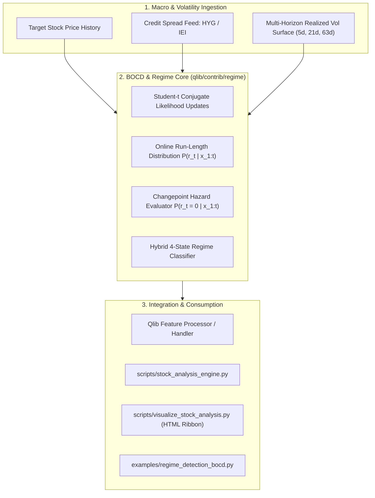

# Implementation Plan: Bayesian Online Changepoint Detection (BOCD) & Macro/Vol Surface Regime Engine

## Problem Statement & Context

Standard machine learning models in Qlib (e.g. Alpha158 + LightGBM/ALSTM) assume financial time series are statistically stationary over multi-year training windows. In live trading, this assumption fails catastrophically when markets shift between low-volatility trending bull runs, choppy mean-reverting consolidations, and high-volatility liquidity contractions.

Naive Hidden Markov Models (HMMs) attempt to address this, but suffer from severe practical deficiencies:
1. **Lagging Real-Time Transitions**: HMM Viterbi decoding requires lookback smoothing, causing state transitions to be recognized many days after market damage has occurred.
2. **Overfitting to Noise**: Fitting HMMs purely on raw price returns creates erratic state oscillations.
3. **Absence of Macro/Credit & Volatility Drivers**: Institutional market regimes are driven by credit risk appetites (liquidity spreads) and options/realized volatility surfaces, not isolated price histories.

This implementation plan delivers an institutional regime architecture combining **Bayesian Online Changepoint Detection (BOCD)** with **Macro Credit Spreads (HYG/IEI)** and **Multi-Horizon Realized Volatility Surfaces**.

---

## User Review Required

> [!IMPORTANT]
> **Data Dependency for Macro Spreads**: To compute the credit spread ratio ($\text{HYG} / \text{IEI}$), market data for `HYG` (iShares High Yield Corporate Bond ETF) and `IEI` (iShares 3-7 Year Treasury Bond ETF) will be supported. If local data for these tickers is absent, the engine will automatically acquire them via the existing `download_us_selected_data.py` pipeline or use a standalone fallback proxy (e.g., market-wide realized volatility surface and high-yield momentum).

> [!TIP]
> **Zero External Heavy Dependencies**: The BOCD engine is engineered using pure, vectorized NumPy and SciPy (`scipy.stats.t` for student-t conjugate updates), avoiding unmaintained C-extensions or external dependencies.

---

## Open Questions

1. **Credit Proxy Ticker Preferences**: By default, we use `HYG` (High Yield) vs. `IEI` (Intermediate Treasuries). Would you prefer also supporting `LQD` (Investment Grade Corporate) or `JNK`? *(Default proposed: auto-fallback between `HYG/IEI` and `HYG/LQD`)*.
2. **Report Display Integration**: Should the interactive HTML report (`visualize_stock_analysis.py`) include a dedicated visual **Market Regime & Changepoint Risk Badge / Ribbon** on the historical timeline? *(Default proposed: Yes, rendered directly on the chart)*.

---

## Proposed Changes



---

### Component 1: Core Regime Engine (`qlib/contrib/regime/`)

#### [NEW] [bocd.py](file:///e:/SRC/GITHUB/my-qlib/qlib/contrib/regime/bocd.py)
* Implementation of the Adams & MacKay (2007) algorithm:
  - Conjugate Normal-Inverse-Gamma / Student-$t$ predictive distributions.
  - Recursive online posterior run-length updates:
    $$P(r_t, \mathbf{x}_{1:t}) = \sum_{r_{t-1}} P(r_t \mid r_{t-1}) P(x_t \mid r_{t-1}, \mathbf{x}^{(r)}) P(r_{t-1}, \mathbf{x}_{1:t-1})$$
  - Constant or Poisson hazard rate function $H(\tau) = \frac{1}{\lambda}$.
  - Real-time changepoint probability score: $P(\text{Changepoint}_t) = P(r_t = 0 \mid \mathbf{x}_{1:t})$.
  - Pruning parameter to drop negligible probability mass for $O(T)$ runtime efficiency.

#### [NEW] [macro_vol_features.py](file:///e:/SRC/GITHUB/my-qlib/qlib/contrib/regime/macro_vol_features.py)
* Ingestion and extraction of non-price regime drivers:
  - **Credit Risk Appetite Ratio**: $\text{CR}_t = \frac{P_{t, \text{HYG}}}{P_{t, \text{IEI}}}$, and its 21-day log change / z-score.
  - **Multi-Horizon Realized Volatility Surface**:
    - Short-term: 5-day realized volatility ($\sigma_{5}$)
    - Medium-term: 21-day realized volatility ($\sigma_{21}$)
    - Long-term: 63-day realized volatility ($\sigma_{63}$)
    - Volatility Term Structure Ratio: $\text{VolRatio} = \frac{\sigma_{5}}{\sigma_{21}}$ (values $> 1.2$ indicate acute volatility shock/inversion).
    - Volatility of Volatility ($\text{VoV}_{21}$): standard deviation of rolling 21-day realized volatility.

#### [NEW] [regime_classifier.py](file:///e:/SRC/GITHUB/my-qlib/qlib/contrib/regime/regime_classifier.py)
* Hybrid regime synthesizer combining BOCD with credit and volatility surface metrics:
  - Outputs a 4-state classification:
    - **State 0: Low-Vol Trending Bull** (Credit spread expanding or flat, $\sigma_5 \le \sigma_{63}$, changepoint prob $< 0.15$)
    - **State 1: Mean-Reverting Choppy Neutral** (Low vol compression, alternating momentum, stable credit)
    - **State 2: High-Vol Liquidation / Risk-Off** (Credit spread collapsing, $\sigma_5 > \sigma_{21}$, high drawdown velocity)
    - **State 3: Regime Transition / Inflection Alert** (BOCD changepoint probability $> 0.50$ or sudden credit divergence)
  - Provides continuous posterior probability vector: $[P(\text{State}_0), P(\text{State}_1), P(\text{State}_2), P(\text{State}_3)]$.

#### [NEW] [__init__.py](file:///e:/SRC/GITHUB/my-qlib/qlib/contrib/regime/__init__.py)
* Exposes `BayesianOnlineChangepointDetector`, `MacroVolFeatureExtractor`, and `MarketRegimeClassifier`.

---

### Component 2: Integration into Stock Analysis & Visual Reports

#### [MODIFY] [stock_analysis_engine.py](file:///e:/SRC/GITHUB/my-qlib/scripts/stock_analysis_engine.py)
* Add `detect_market_regime(symbol, data_dir, stock_df)` function.
* Automatically incorporates regime state into:
  - Projections: Adjusts forward drift $\mu$ and volatility $\sigma$ based on detected regime (e.g. dampening bull projections when State 2 / Risk-Off is active).
  - Buy recommendations: Adds regime confirmation filters to `predict_future_buy_timing` (e.g. withholding `STRONG BUY` if State 2 or State 3 alert is triggered).

#### [MODIFY] [visualize_stock_analysis.py](file:///e:/SRC/GITHUB/my-qlib/scripts/visualize_stock_analysis.py)
* Add a **Market Regime & Changepoint Risk Card** to the top metrics grid:
  - Current regime badge (e.g., `Low-Vol Bull`, `Risk-Off Liquidation`, or `Regime Shift Detected`).
  - Changepoint hazard meter ($0 - 100\%$).
  - Credit spread and volatility term structure indicators.
* Render a subtle colored regime ribbon / background shading on the Canvas historical timeline.

---

### Component 3: Standalone Example & Verification Tests

#### [NEW] [regime_detection_bocd.py](file:///e:/SRC/GITHUB/my-qlib/examples/regime_detection_bocd.py)
* Standalone executable demonstrating BOCD and macro regime classification on historical market crashes and regime changes (e.g., 2020 COVID crash, 2022 rate-hike bear market, 2023–2024 bull recovery).

#### [NEW] [test_bocd_regime.py](file:///e:/SRC/GITHUB/my-qlib/tests/test_bocd_regime.py)
* Comprehensive automated unit test suite:
  - Synthetic data step-change detection accuracy.
  - Run-length posterior probability normalization.
  - Credit spread ratio and vol surface calculations.
  - Regime classifier state stability and edge-case handling.

---

## Verification Plan

### Automated Tests
1. **Unit Tests for BOCD and Regime Classifier**:
   ```powershell
   python tests/test_bocd_regime.py
   ```
2. **Existing Test Suites Regression**:
   ```powershell
   python tests/test_stock_analysis_engine.py
   python tests/test_download_us_selected_data.py
   ```

### Manual Verification
1. **Run Standalone Demonstration**:
   ```powershell
   python examples/regime_detection_bocd.py --symbols SPY --start 2019-01-01 --end 2024-01-01
   ```
   Verify that changepoints align with known historical shocks (February/March 2020, January 2022).
2. **Generate Interactive Report with Regime Visuals**:
   ```powershell
   python scripts/visualize_stock_analysis.py --symbol MSFT --open
   ```
   Verify that the Market Regime card and changepoint probabilities render seamlessly in the interactive HTML dashboard.
