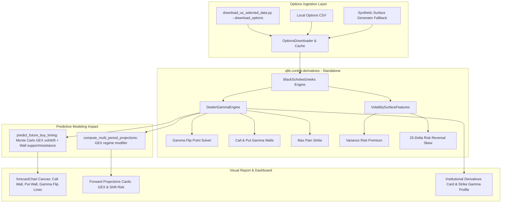

# Implementation Plan: Trader Demand 3 &ndash; Dealer Gamma Exposure (GEX) & Options Flow

Integrate **Dealer Gamma Exposure (GEX)**, **Gamma Flip Point (Volatility Trigger)**, **Gamma Walls (Call/Put Pins)**, **Max Pain**, and **Options Volatility Surface Dynamics (25&Delta; Skew & Variance Risk Premium)** into Qlib and the stock analysis engine.

---

## 1. Executive Summary & Response to User Comments

### A. How is the Option Chain Data Downloaded?
1. **Dedicated Downloader in Module**:
   [`qlib/contrib/derivatives/options_data.py`](file:///e:/SRC/GITHUB/my-qlib/qlib/contrib/derivatives/options_data.py) provides a standalone `OptionsDownloader` and `OptionsDataLoader`. It fetches full option chains (all strikes, expirations, calls, puts, bid/ask, implied vol, open interest) using Yahoo Finance's options API (`yfinance` or direct urllib REST endpoints) and caches them locally to:
   `<data_dir>/options/<SYMBOL>_options.csv` (or `<SYMBOL>.csv`).
2. **Integrated into Download Pipeline**:
   [`scripts/download_us_selected_data.py`](file:///e:/SRC/GITHUB/my-qlib/scripts/download_us_selected_data.py) will receive a `--download_options` flag. When executed (or when `auto_download=True`), it downloads the options chain alongside historical daily bars.
3. **Graceful Offline Fallback**:
   If offline, or if a symbol has no active options market (e.g. illiquid small-caps), the engine generates a deterministic **Synthetic Option Surface** calibrated to the stock's spot price, historical skew, and BOCD 21-day realized volatility surface, ensuring 100% offline autonomy and test reliability.

### B. Impact on Future Projections & Estimates (3-Month Forecast & Multi-Period)
The GEX module is engineered as a **standalone component** in `qlib.contrib.derivatives`, but directly feeds into the predictive models:
1. **3-Month Predictive Buy Analysis (`predict_future_buy_timing`)**:
   - **Support & Resistance Anchored to Gamma Walls**:
     - `key_support` incorporates the **Major Put Gamma Wall** (major dealer support floor) and **Max Pain**.
     - `key_resistance` incorporates the **Major Call Gamma Wall** (overhead dealer ceiling/magnet pin).
   - **Regime-Conditioned Monte Carlo Simulation**:
     - **Positive Gamma Regime ($+\text{GEX}$)**: Dealers hedge counter-cyclically (buying dips, selling rips). Realized volatility is dampened ($0.85\times$ daily vol in Monte Carlo), and a mean-reverting drift pull toward the Call Wall / Max Pain pin is applied.
     - **Negative Gamma Regime ($-\text{GEX}$)**: Dealers hedge pro-cyclically (selling declines, buying rallies). Volatility is expanded ($1.25\times$ daily vol), downside skew is injected, and the optimal buy window is delayed by 15&ndash;35 days to avoid catching dealer liquidation cascades.
   - **Tactical Recommendation Upgrades**:
     - Below Gamma Flip in $-\text{GEX}$: `"NEGATIVE GAMMA RISK / CAPITAL PRESERVATION"`.
     - Above Gamma Flip near Put Wall: `"GAMMA WALL REBOUND ACCUMULATION"`.
2. **Multi-Period Forward Return Projections (`compute_multi_period_projections`)**:
   - GEX regime modifier dynamically blends near-term drift and volatility, displaying Net GEX and Gamma Flip distance on projection cards.

### C. Visual Impact on Future Predictions (Chart & Cards)
1. **3-Month Forward Forecast Canvas (`forecastChart`)**:
   - Renders the **Call Gamma Wall Line** (emerald/amber dashed line & badge: `Call Wall $XXX (Dealer Ceiling)`).
   - Renders the **Put Gamma Wall Line** (rose/red dashed line & badge: `Put Wall $XXX (Dealer Floor)`).
   - Renders the **Gamma Flip Point Line** (purple dotted line & badge: `Gamma Flip $XXX (Vol Trigger)`).
   - Visually shades or demarcates the **$+\text{GEX}$ Volatility Compression Zone** vs. **$-\text{GEX}$ Volatility Expansion Zone**.
2. **3-Month Strategy Card**:
   - Displays GEX Regime (`+GEX Stabilizer` vs `-GEX Accelerant`), Gamma Flip level, and distance % to flip.
3. **Institutional Derivatives Card**:
   - Displays Net Dollar GEX (\$M / 1% move), Gamma Flip, Call/Put Walls, Max Pain, Put/Call OI Ratio, and Variance Risk Premium (VRP).
   - Features an interactive **Horizontal Strike Gamma Profile** visualizing Net GEX distribution across strikes.

---

## 2. Proposed Architecture & Changes



---

### Component 1: Standalone `qlib.contrib.derivatives`

#### [NEW] [`qlib/contrib/derivatives/__init__.py`](file:///e:/SRC/GITHUB/my-qlib/qlib/contrib/derivatives/__init__.py)
Exports `DealerGammaEngine`, `BlackScholesGreeks`, `VolatilitySurfaceFeatures`, and `OptionsDataLoader`.

#### [NEW] [`qlib/contrib/derivatives/gex.py`](file:///e:/SRC/GITHUB/my-qlib/qlib/contrib/derivatives/gex.py)
- Vectorized Black-Scholes Gamma ($\Gamma$) and Delta ($\Delta$) using pure NumPy.
- Calculates per-strike and aggregate Net Dollar GEX:
  $$\text{GEX}_{\$}(K) = \left[\text{OI}_C(K) \cdot \Gamma_C(K) - \text{OI}_P(K) \cdot \Gamma_P(K)\right] \times S^2 \times 100 \times 0.01$$
- Solves for the **Gamma Flip Point ($S^*$)** where $\text{Total GEX}(S^*) = 0$.
- Identifies Call Gamma Wall, Put Gamma Wall, Absolute Gamma Wall, and Max Pain strike.
- Classifies GEX regime (`+GEX Stabilizer` vs `-GEX Accelerant`).

#### [NEW] [`qlib/contrib/derivatives/vol_surface.py`](file:///e:/SRC/GITHUB/my-qlib/qlib/contrib/derivatives/vol_surface.py)
- 25-Delta Risk Reversal skew ($\text{RR}_{25} = \text{IV}_{\text{call}} - \text{IV}_{\text{put}}$).
- Variance Risk Premium ($\text{VRP} = \text{IV}_{30d} - \sigma_{21d}$).

#### [NEW] [`qlib/contrib/derivatives/options_data.py`](file:///e:/SRC/GITHUB/my-qlib/qlib/contrib/derivatives/options_data.py)
- Option chain loader, disk cacher, and deterministic synthetic surface generator.

#### [NEW] [`qlib/contrib/derivatives/README.md`](file:///e:/SRC/GITHUB/my-qlib/qlib/contrib/derivatives/README.md)
Architectural documentation, mathematical derivations, and usage guides.

---

### Component 2: Download Pipeline Integration

#### [MODIFY] [`scripts/download_us_selected_data.py`](file:///e:/SRC/GITHUB/my-qlib/scripts/download_us_selected_data.py)
- Add `--download_options` CLI flag.
- Add `download_option_chains(symbols, target_dir)` saving option chains to `<target_dir>/options/<SYMBOL>_options.csv`.

---

### Component 3: Stock Analysis Engine & Predictions Integration

#### [MODIFY] [`scripts/stock_analysis_engine.py`](file:///e:/SRC/GITHUB/my-qlib/scripts/stock_analysis_engine.py)
- Add `compute_dealer_gex_features(df, symbol=symbol, data_dir=data_dir)`:
  Computes Net GEX, GEX Regime, Gamma Flip, Call/Put Walls, Max Pain, and VRP.
- Pass `derivatives` summary into `predict_future_buy_timing()`:
  - Anchor `key_support` to Put Gamma Wall and Max Pain.
  - Anchor `key_resistance` to Call Gamma Wall.
  - Modulate Monte Carlo volatility: compress ($0.85\times$) in $+\text{GEX}$, expand ($1.25\times$) in $-\text{GEX}$.
  - Inject dealer gamma cascade guidance into tactical recommendations.
- Pass `derivatives` summary into `compute_multi_period_projections()`.

---

### Component 4: Visual Display & Predictive Charts

#### [MODIFY] [`scripts/visualize_stock_analysis.py`](file:///e:/SRC/GITHUB/my-qlib/scripts/visualize_stock_analysis.py)
- **3-Month Predictive Forecast Chart (`forecastChart`)**:
  - Draw horizontal Call Gamma Wall line, Put Gamma Wall line, and Gamma Flip line with interactive tooltips.
- **Institutional Derivatives & GEX Card**:
  - Metric badges for Net GEX, GEX Regime, Gamma Flip, Call/Put Walls, Max Pain, VRP.
  - Horizontal Strike Gamma Profile visualization.
- **Console Terminal Printout**:
  - Add GEX section displaying Net GEX, Gamma Flip, Call Wall, Put Wall, and Max Pain.

---

### Component 5: Verification & Tests

#### [NEW] [`tests/test_derivatives_gex.py`](file:///e:/SRC/GITHUB/my-qlib/tests/test_derivatives_gex.py)
- Unit tests verifying:
  1. Black-Scholes Greek calculation accuracy and symmetry.
  2. Net GEX aggregation logic.
  3. Gamma Flip point root-finding convergence.
  4. Call Wall, Put Wall, and Max Pain strike detection.
  5. Fallback synthetic option chain generation.
  6. Impact on `predict_future_buy_timing` (support/resistance anchoring and vol modulation).

#### [NEW] [`examples/derivatives_gex_analysis.py`](file:///e:/SRC/GITHUB/my-qlib/examples/derivatives_gex_analysis.py)
Standalone CLI example demonstrating GEX calculation, strike profile, and regime classification for any ticker.

---

## 3. Verification Plan

### Automated Tests
1. Run derivatives unit test suite:
   ```powershell
   python e:\SRC\GITHUB\my-qlib\tests\test_derivatives_gex.py
   ```
2. Run full regression test suite:
   ```powershell
   python e:\SRC\GITHUB\my-qlib\tests\test_stock_analysis_engine.py
   python e:\SRC\GITHUB\my-qlib\tests\test_microstructure.py
   python e:\SRC\GITHUB\my-qlib\tests\test_bocd_regime.py
   ```

### Manual & Visual Verification
1. Run visualizer on live semiconductor data (`SMH`):
   ```powershell
   python e:\SRC\GITHUB\my-qlib\scripts\visualize_stock_analysis.py --symbol SMH --data_dir D:\trading\qlib --report_dir D:\trading\custom_reports
   ```
2. Verify:
   - Console terminal output includes GEX metrics and Gamma Flip level.
   - HTML dashboard renders the **Institutional Derivatives Card** and the **Call Wall / Put Wall / Gamma Flip lines on the 3-Month Predictive Forecast Canvas**.
