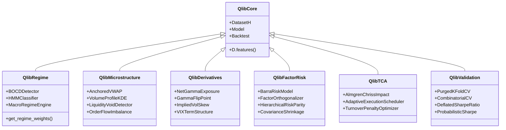

```mermaid
flowchart LR
    subgraph Trader["Part I: Trader's Demands"]
        T1["Regime Detection (HMM/Vol)"]
        T2["Liquidity / Anchored VWAP / Profile"]
        T3["Options Flow / Dealer GEX"]
        T4["Event & Earnings Catalysts"]
        T5["ATR / Dynamic Sizing & Stops"]
    end

    subgraph Manager["Part II: Hedge Fund Review"]
        M1{"Institutional Feasibility & Math Audit"}
        M2["Identify Critical Missing Gaps:<br/>• Factor Neutralization (Barra)<br/>• Market Impact / TCA (Almgren)<br/>• Combinatorial Purged CV (De Prado)<br/>• Hierarchical Risk Parity (HRP)"]
    end

    subgraph Blueprint["Part III: Master Qlib Additions"]
        B1["qlib.contrib.regime"]
        B2["qlib.contrib.microstructure"]
        B3["qlib.contrib.derivatives"]
        B4["qlib.contrib.factor_risk"]
        B5["qlib.contrib.tca"]
        B6["qlib.contrib.validation"]
    end

    Trader --> M1
    M1 --> M2
    M2 --> Blueprint
```

# Strategic Blueprint: Advanced Predictive Financial Tools for Qlib
## A Collaborative Dialogue Between a Profitable Stock Trader and an Institutional Hedge Fund Manager

---

## Executive Summary

Microsoft Qlib is an exceptional academic and quantitative research framework for tabular machine learning and cross-sectional equity ranking. Its Alpha158/Alpha360 feature engines, LightGBM/neural model wrappers, and vectorized backtesters provide a solid baseline for quantitative modeling.

However, **there is a vast chasm between a backtest running on historical daily close prices and live, profitable trading in modern financial markets.**

This document presents a rigorous architectural review and enhancement blueprint for Qlib:
1. **Part I: The Profitable Stock Trader's Demands** — Practical, edge-generating requirements from an active trader battling real market dynamics (liquidity, options flow, volatility regimes, and event risk).
2. **Part II: The Hedge Fund Manager's Institutional Review & Critique** — A ruthless institutional evaluation from a Tier-1 quantitative hedge fund CIO, validating valid demands, rejecting discretionary biases, and exposing critical institutional gaps (factor neutralization, market impact, purged validation).
3. **Part III: Master Enhancement Blueprint for Qlib** — Concrete specifications, mathematical formulations, and proposed modules to elevate Qlib into a world-class institutional trading and predictive analytics ecosystem.

---

---

## Part I: The Profitable Stock Trader's Demands

> **Perspective**: *Veteran Discretionary & Quantitative Prop Trader*  
> **Capital at Risk**: Multi-million personal and proprietary capital.  
> **Objective**: Generating consistent alpha, capital preservation, exploiting asymmetric risk/reward setups, and avoiding catastrophic drawdowns.

### Trader's Critique of Existing Qlib Capabilities
"I have reviewed Qlib's architecture. It excels at training regression or ranking algorithms (like LightGBM or ALSTM) on standardized rolling bars. But in real trading, **Qlib operates in a sterile, academic vacuum.** It assumes stationarity across years, ignores the derivatives elephant in the room, has zero awareness of order flow or volume distribution, and naively rebalances portfolios with equal weights at the daily closing price. If you trade real size with raw Qlib today, you will get chopped to pieces by market regimes, front-run on execution, and blown up on earnings gaps."

### Demand 1: Market Regime & Volatility State Conditioning
* **The Problem**: Qlib trains a single static model across a 5–10 year window. A model optimized during a low-volatility secular bull market (e.g., 2017) gets obliterated during a high-volatility liquidity contraction (e.g., 2022).
* **The Demand**:
  1. Add native **Hidden Markov Models (HMM)** and **Gaussian Mixture Models (GMM)** to classify market regimes into at least 4 states:
     - Low-Volatility Trending (Bull)
     - High-Volatility Trending (Bear / Liquidation)
     - Low-Volatility Range-Bound (Mean-Reversion)
     - High-Volatility Compression (Pre-breakout / Squeeze)
  2. Implement **Dynamic Regime-Conditioned Ensembling**: Models should automatically switch or adjust weights between trend-following alphas and mean-reversion alphas based on the detected state.

### Demand 2: Institutional Liquidity, Volume Profile & Anchored VWAP (AVWAP)
* **The Problem**: Qlib treats volume as a simple daily scalar (`$volume`). In the real world, **price moves between liquidity nodes.** Large institutions execute orders relative to benchmark VWAPs and high-volume price clusters.
* **The Demand**:
  1. **Anchored VWAP (AVWAP)**: Capability to calculate VWAP anchored to key market inflection dates:
     $$\text{AVWAP}_{t_0, t} = \frac{\sum_{\tau=t_0}^t P_\tau \cdot V_\tau}{\sum_{\tau=t_0}^t V_\tau}$$
     Anchors must include: Year-to-Date (YTD), Quarter-to-Date (QTD), rolling 52-week High/Low, and most recent Earnings Announcement date.
  2. **Volume-at-Price Profiling**: Calculate **Point of Control (POC)**, **Value Area High (VAH)**, and **Value Area Low (VAL)** (the 70% volume distribution envelope). Assets trading below low-volume nodes (liquidity voids) exhibit explosive moves that standard price momentum factors fail to capture.

### Demand 3: Options-Implied Signals & Dealer Gamma Exposure (GEX)
* **The Problem**: Equities do not move in isolation. The options market is often larger in notional volume than the underlying cash market. Market makers delta-hedge dynamically, creating massive mechanical buying or selling pressure.
* **The Demand**:
  1. Integrate options data to calculate **Dealer Gamma Exposure (GEX)**:
     $$\text{GEX} = \sum_{i} \Gamma_i \cdot S \cdot \text{OpenInterest}_i \cdot 100 \cdot \text{Spot}$$
     - **Positive Gamma Regime ($+\text{GEX}$)**: Market makers buy dips and sell rips $\rightarrow$ Low realized volatility, mean-reversion favored.
     - **Negative Gamma Regime ($-\text{GEX}$)**: Market makers sell into declines and buy into rallies $\rightarrow$ Cascading volatility, directional trend-following favored.
  2. **Implied Volatility Skew & Term Structure**: Quantify the 25-delta put/call skew and VIX term structure (contango vs. backwardation) as leading indicators for equity pullbacks.

### Demand 4: Catalyst & Event Risk Architecture
* **The Problem**: Qlib blindly holds positions through quarterly earnings releases and FOMC announcements. In equities, a single -25% post-earnings gap destroys an entire quarter's alpha.
* **The Demand**:
  1. **Event Awareness Engine**: Maintain an event calendar for corporate earnings, FOMC rate decisions, and CPI releases.
  2. **Automated Risk De-Grossing**: Option to automatically reduce position size by 50–100% within 48 hours of binary events, or implement systematic pre-earnings volatility hedges.
  3. **Post-Earnings Announcement Drift (PEAD)**: Formalize PEAD factor models to systematically trade the continuation of earnings surprises.

### Demand 5: Dynamic Position Sizing & Asymmetric Stop-Loss Framework
* **The Problem**: Qlib's portfolio generators (`TopkDropoutStrategy`) allocate fixed dollar amounts across top-ranked assets. It lacks volatility parity, dynamic stop losses, or profit-taking stages.
* **The Demand**:
  1. **Average True Range (ATR) Volatility Parity**: Equalize risk contribution per trade:
     $$\text{Position Size}_i = \frac{\text{Portfolio Capital} \times \text{Risk Fraction}}{\kappa \times \text{ATR}_i}$$
  2. **Trailing Stop-Loss & Target Corridor Engine**: Introduce built-in bracket orders (e.g., dynamic Chandelier stops, structural swing lows, and multi-tier trailing profit targets).

---

## Part II: The Hedge Fund Manager's Institutional Review & Critique

> **Perspective**: *Chief Investment Officer (CIO) / Head of Quantitative Research, Multi-Billion Quantitative Hedge Fund*  
> **Mandate**: Deliver double-digit net annualized returns with a Sharpe ratio $> 2.0$, net zero market/factor beta, and zero catastrophic drawdown tolerance.

### Executive Assessment of the Trader's Demands
"The trader's demands reflect genuine frontline intuition. They correctly identify that Qlib in its current state is primarily an **academic tabular ML benchmarking toolkit**, rather than an institutional production platform. The trader's focus on non-stationarity, derivatives flow, and event risk is spot-on.

However, the trader's approach suffers from classic discretionary heuristics: **a lack of cross-sectional factor orthogonalization, unconstrained sizing risks, and naive backtest assumptions.** Below is my formal institutional audit of the trader's demands, followed by the critical gaps the trader completely overlooked."

---

### Audit of Trader Demands

| Trader Demand | Hedge Fund Verdict | Institutional Analysis & Required Refinements |
|---|---|---|
| **1. Regime Detection (HMM/GMM)** | **APPROVED (With Modifications)** | Static ML models fail because financial time series are non-stationary. However, naive HMMs often overfit and lag real-time transitions. **Requirement**: Must use **Bayesian Online Changepoint Detection (BOCD)** or a combination of macro credit spreads (HYG/IEI, Ted spread) and realized vol surfaces, rather than purely fitting price returns. |
| **2. Anchored VWAP & Volume Profile** | **APPROVED (Mathematically Formalized)** | Institutional execution algorithms (TWAP/VWAP/POV) inherently create price memory around major anchors. However, 'Value Area' heuristics must be replaced with continuous **Kernel Density Estimation (KDE)** of volume-at-price and statistical order-flow imbalance metrics. |
| **3. Dealer Gamma Exposure (GEX)** | **HIGH PRIORITY APPROVAL** | The single highest-value edge in modern US equity markets. The explosion of zero-DTE options has amplified market-maker delta hedging by orders of magnitude. Tracking Net Gamma, the Volatility Trigger (flip point from $+\text{GEX}$ to $-\text{GEX}$), and Gamma Pin strikes is mandatory. |
| **4. Event Risk & PEAD Models** | **APPROVED** | Binary gap risk cannot be diversified away cross-sectionally when multiple portfolio companies report in the same week. A systematic event overlay is standard practice in every serious quantitative fund. |
| **5. ATR Sizing & Stop-Losses** | **CONDITIONALLY REJECTED / REDESIGNED** | Individual asset stop-losses frequently induce **'whipsaw drag'** in systematic equity portfolios, degrading Sharpe ratios by cutting winners before mean-reversion. Position sizing must be determined via **Portfolio-Level Covariance Optimization (HRP or Convex Optimization)**, not independent single-stock ATR stops. |

---

### Critical Gaps the Trader Overlooked (Institutional Blind Spots)

The trader missed four fundamental elements required for true quantitative profitability:

#### 1. The Factor Confounding Trap (Lack of Barra-Style Factor Neutralization)
* **The Flaw**: A LightGBM model trained on raw price features might produce a high backtest Sharpe simply because it loaded up on tech momentum or small-cap beta during a bull run.
* **Institutional Requirement**: Qlib must implement **Cross-Sectional Factor Neutralization**. Every alpha signal ($S$) must be orthogonalized against known risk factors (Market Beta, Size, Value, Momentum, Volatility, Sector/Industry) using weighted least squares (WLS):
  $$S_{\text{raw}} = \mathbf{X}_{\text{Barra}} \beta + \epsilon \implies S_{\text{pure}} = \epsilon$$
  Without this, you are not trading alpha; you are trading unhedged, leveraged factor tilts.

#### 2. Realistic Market Impact & Transaction Cost Analysis (TCA)
* **The Flaw**: Qlib assumes fixed basis-point execution slippage. If an alpha strategy turns over 20% of the portfolio daily, real-world execution will consume 100% of the returns.
* **Institutional Requirement**: Implement non-linear **Square-Root Market Impact Models** (Almgren-Chriss / Kyle's Lambda):
  $$\text{Impact Cost} = \eta \cdot \sigma_{\text{daily}} \cdot \sqrt{\frac{\text{Order Volume}}{\text{ADV}}}$$
  A trade must only execute if the expected alpha decay exceeds the non-linear execution penalty.

#### 3. Overfitting, Data Leakage & Purged Cross-Validation
* **The Flaw**: Qlib's default time-series splitting allows serial correlation leakage. Financial returns have long memory in volatility.
* **Institutional Requirement**: Implement **Combinatorial Purged & Embargoed Cross-Validation (CPCV)** (Marcos López de Prado) and compute the **Deflated Sharpe Ratio (DSR)** to account for multiple-testing selection bias.

#### 4. Advanced Portfolio Construction: Hierarchical Risk Parity (HRP)
* **The Flaw**: Top-k equal weighting is primitive; Markowitz Mean-Variance Optimization is notoriously unstable (an "error maximizer").
* **Institutional Requirement**: Implement **Hierarchical Risk Parity (HRP)** and **Risk-Constrained Convex Optimization** using graph clustering on the covariance matrix.

---

## Part III: Master Blueprint for the Best Additions to Qlib

To transform Qlib from an academic research tool into an elite quantitative trading engine, the following six core modules must be developed and integrated into the codebase:

---

### Module 1: `qlib.contrib.regime` (Market Regime & Dynamic Conditioning)

#### Core Classes & Functions:
1. **`MarketRegimeDetector(method='bocd' | 'hmm' | 'gmm')`**:
   - Classifies market state into 4 regimes based on realized volatility, market breadth (% of stocks above 50 SMA), credit spread changes, and high-yield momentum.
   - Computes smooth posterior transition probabilities: $P(S_t = k \mid \mathcal{F}_t)$.
2. **`RegimeEnsembleModel(models_dict, regime_detector)`**:
   - Dynamic meta-model wrapper. Dynamically routes predictions or blends model outputs based on current regime weights:
     $$\hat{y}_t = \sum_{k=1}^K P(S_t = k) \cdot M_k(\mathbf{x}_t)$$
   - *Example*: Allocates 80% weight to a trend model in Regime 1 (Low-Vol Bull), but shifts 80% weight to a mean-reversion/short model in Regime 2 (High-Vol Liquidation).

---

### Module 2: `qlib.contrib.microstructure` (Liquidity, AVWAP & Volume Profile)

#### Core Classes & Functions:
1. **`AnchoredVWAP(anchor_event='ytd' | 'earnings' | 'swing_extreme' | 'custom_date')`**:
   - Vectorized computation of Anchored VWAP and continuous standard deviation dispersion bands ($+1\sigma, +2\sigma, -1\sigma, -2\sigma$).
   - Creates dynamic support/resistance alpha features:
     $$\text{Spread\_AVWAP}_t = \frac{P_t - \text{AVWAP}_{t_0, t}}{\sigma_{\text{AVWAP}}}$$
2. **`VolumeProfileKDE(lookback=60, bandwidth='silverman')`**:
   - Replaces crude discrete price buckets with Gaussian Kernel Density Estimation over price:
     $$\hat{f}(p) = \frac{1}{\sum V_i} \sum_{i=1}^N V_i \cdot \frac{1}{h} K\left(\frac{p - P_i}{h}\right)$$
   - Generates exact institutional metrics: **High-Volume Nodes (HVN / POC)** and **Low-Volume Nodes (LVN / Liquidity Voids)**.
   - Stocks trading into Low-Volume Nodes receive high expected velocity flags.

---

### Module 3: `qlib.contrib.derivatives` (Options Flow, GEX & Volatility Surfaces)

#### Core Classes & Functions:
1. **`DealerGammaEngine(options_provider_uri)`**:
   - Computes daily per-symbol and market-wide Net Gamma Exposure (**GEX**).
   - Identifies the **Gamma Flip Point** (zero-gamma threshold where market transition accelerates).
   - Identifies **Max Pain** and **Gamma Wall Strike Prices** that act as gravitational targets for expiry dates.
2. **`VolatilitySurfaceFeatures()`**:
   - Computes **25-Delta Risk Reversal**: $\text{RR}_{25} = \text{IV}_{\text{call}, 25\Delta} - \text{IV}_{\text{put}, 25\Delta}$.
   - Computes **IV vs. Realized Volatility Spread (Variance Risk Premium - VRP)**:
     $$\text{VRP}_t = \text{IV}_{t, 30d} - \sigma_{\text{realized}, 30d}$$
     A high positive VRP indicates excessive market fear $\rightarrow$ prime conditions for equity mean-reversion buying.

---

### Module 4: `qlib.contrib.factor_risk` (Barra-Style Neutralization & HRP Optimization)

#### Core Classes & Functions:
1. **`FactorOrthogonalizer(risk_factors_df)`**:
   - Runs cross-sectional Weighted Least Squares (WLS) each rebalance period:
     $$\mathbf{R}_t = \mathbf{X}_t \mathbf{f}_t + \mathbf{u}_t$$
   - Strips common beta, industry, and style factor returns, ensuring the generated alpha score has zero correlation to market directions or sector rotation.
2. **`HierarchicalRiskParity(covariance_estimator='ledoit_wolf')`**:
   - Implements Marcos López de Prado’s Hierarchical Risk Parity:
     - Step 1: Hierarchical tree clustering of correlation matrix: $d_{i,j} = \sqrt{\frac{1}{2}(1 - \rho_{i,j})}$.
     - Step 2: Matrix seriation / quasi-diagonalization.
     - Step 3: Recursive bisection allocation based on inverse cluster variance.
   - Eliminates matrix inversion errors and avoids concentration risk without requiring expected return estimates.

---

### Module 5: `qlib.contrib.tca` (Market Impact & Realistic Execution Simulation)

#### Core Classes & Functions:
1. **`AlmgrenChrissImpactModel(eta=0.14, gamma=0.1)`**:
   - Models temporary and permanent market impact:
     $$\Delta P_{\text{perm}} = \gamma \cdot \sigma \cdot \left(\frac{Q}{V}\right), \quad \Delta P_{\text{temp}} = \eta \cdot \sigma \cdot \left(\frac{Q}{V \cdot \tau}\right)^\alpha$$
   - Injects realistic non-linear slippage into `qlib.backtest.executor.SimulatorExecutor`.
2. **`OptimalExecutionOptimizer(decay_rate, impact_params)`**:
   - Solves trade scheduling: Balances the risk of alpha decay from slow trading against the market impact cost of rapid trading.

---

### Module 6: `qlib.contrib.validation` (Purged K-Fold CV & Overfitting Auditing)

#### Core Classes & Functions:
1. **`PurgedGroupTimeSeriesSplit(n_splits=5, pct_embargo=0.01)`**:
   - Prevents lookahead leakage and label overlap between training and validation folds by enforcing a purge window (length of prediction horizon) and an embargo window (autocorrelation decay time).
2. **`DeflatedSharpeRatio(backtest_sharpe, returns_series, n_trials)`**:
   - Computes the true statistical significance of a backtested Sharpe ratio given the number of parameter configurations or factor variations tested:
     $$\text{DSR} = \Phi\left(\frac{(\widehat{\text{SR}} - \text{SR}_0)\sqrt{T-1}}{\sqrt{1 - \hat{\gamma}_3 \widehat{\text{SR}} + \frac{\hat{\gamma}_4 - 1}{4}\widehat{\text{SR}}^2}}\right)$$
   - Weeds out false discovery alphas that look stellar on paper but are pure statistical noise.

---

## Part IV: Implementation Feasibility & Priority Matrix

To execute these additions systematically, development should be staged across four priority tiers:

| Tier | Module / Feature | Estimated Complexity | Alpha / Risk Impact | Dependencies |
|:---:|---|:---:|:---:|---|
| **P0 (Immediate)** | **`qlib.contrib.factor_risk`** • Factor Orthogonalizer • Hierarchical Risk Parity (HRP) | Medium | **Massive** (Eliminates unhedged factor beta and drawdown spikes) | `scipy`, `scikit-learn` |
| **P0 (Immediate)** | **`qlib.contrib.microstructure`** • Anchored VWAP (YTD, Earnings, High/Low) • Volume Profile & POC Engine | Low-Medium | **High** (Provides structural trade entries and key inflection points) | Existing Qlib binary data / CSVs |
| **P1 (Near-Term)** | **`qlib.contrib.regime`** • Bayesian Changepoint & HMM Detector • Dynamic Regime Model Blending | Medium | **High** (Prevents model failure across secular market shifts) | `hmmlearn` or `ruptures` |
| **P1 (Near-Term)** | **`qlib.contrib.validation`** • Purged / Embargoed K-Fold CV • Deflated Sharpe Ratio (DSR) | Low-Medium | **High** (Stops deployment of overfitted strategies) | Built-in Qlib workflow |
| **P2 (Mid-Term)** | **`qlib.contrib.derivatives`** • Options GEX (Net Gamma Exposure) • 25-Delta Skew & VRP Calculations | High | **Exceptional** (Exploits market-maker delta hedging flows) | Requires Options Chain Data Feed (CBOE / Polygon / OPRA) |
| **P3 (Long-Term)** | **`qlib.contrib.tca`** • Almgren-Chriss Square-Root Impact • Alpha Decay vs. Impact Trade Optimizer | High | **Crucial for Scale** (Enables realistic execution for institutional AUM) | Order book / intraday volume data |

---

## Conclusion

By marrying the **intuitive frontline demands of a profitable stock trader** (regime adaptation, liquidity structure, options flow, and event controls) with the **mathematical rigor and risk constraints of a top-tier hedge fund manager** (factor neutralization, non-linear market impact, purged validation, and HRP portfolio construction), this blueprint equips Qlib with a complete, institutional-grade quantitative trading framework.

