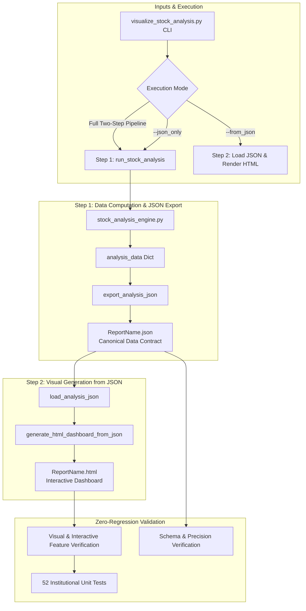

# Implementation Plan: Refactor `visualize_stock_analysis.py` into Two-Step Reporting Pipeline

## Executive Summary
Refactor the stock analysis reporting engine in [`scripts/visualize_stock_analysis.py`](file:///e:/SRC/GITHUB/my-qlib/scripts/visualize_stock_analysis.py) into a clean, decoupled **two-step process**:
1. **Step 1 (Data Export)**: Compute and serialize all analytical, predictive, and microstructure results into a canonical `.json` file saved with the same base file name (`<report_path>.json`).
2. **Step 2 (Visual Rendering)**: Refactor [`visualize_stock_analysis.py`](file:///e:/SRC/GITHUB/my-qlib/scripts/visualize_stock_analysis.py) to remove the embedded data payload from the script and instead load all required content directly from the `.json` file.

To guarantee zero regression in functionality, performance, or interactive features, the **`team-code`** team is expanded to include three dedicated specialist roles working in close collaboration:
- **The Architect**: Oversees pipeline design, JSON schema specifications, protocol compatibility (`file:///` vs `http://`), and architectural decoupling.
- **The Principal Developer**: Implements JSON serialization/deserialization, CLI enhancements (`--from_json`, `--json_only`), and backward-compatible core APIs.
- **The Senior Refactoring Specialist**: Audits the monolithic codebase, separates data computation from visual rendering, modularizes dashboard card builders, and executes comprehensive visual and data regression benchmarks.

---

## User Review Required

> [!IMPORTANT]
> **Dual End-User Perspective Alignment** (per [`.team-code/requirements.md`](file:///e:/SRC/GITHUB/my-qlib/.team-code/requirements.md)):
> - **The Profitable Stock Trader**:
>   - *Demands*: Retaining 100% of the interactive capabilities: Anchored VWAP bands, Volume Profile KDE, Dealer GEX walls and gamma flip, Bayesian changepoint pins (`⚡`), corporate catalyst countdowns (`E ▲`, `E ▼`, `◆`), Best Buy profit corridors, and the `[★ Best Buys: ON/OFF]` / `[⚡ Key Events: ON/OFF]` toolbar toggles.
>   - *Benefits*: Gaining direct access to the structured `.json` data file allows automated trading algorithms, alerting scripts, and spreadsheet models to consume price targets, stop-losses, and regime states without HTML scraping.
> - **The Institutional Hedge Fund Manager**:
>   - *Demands*: Formal data contract schemas, strict separation of computational logic from presentation, reproducible batch pipelines, and 100% test pass rate across the 52-test institutional suite.
>   - *Benefits*: Archiving the canonical `.json` files enables systematic time-series factor research, cross-sectional portfolio aggregation, and post-trade drift audits across thousands of tickers.

> [!NOTE]
> **Zero-Server Local Execution & Embedded JSON Container Strategy**:
> Per user guidance, the report generation creates a local `.json` file containing the complete canonical dataset, and embeds this `.json` content directly into the `.html` file inside a standard application JSON block:
> ```html
> <script id="report-data" type="application/json">
>   { ... canonical JSON content ... }
> </script>
> ```
> 
> **Key Architectural Advantages**:
> 1. **Standalone Portability (`file:///` safe)**: The `.html` report operates 100% out-of-the-box when opened directly from disk via `file:///` in any browser, with zero CORS blocks and without requiring any web server.
> 2. **Canonical JSON Artifact Preserved**: The standalone companion `.json` file (`<report_path>.json`) is always written first in Step 1, giving automated trading bots, quantitative researchers, and external systems direct access to the structured data.
> 3. **Single Source of Truth**: Step 2 of `visualize_stock_analysis.py` reads from the newly created `.json` file to construct the HTML report and embed the JSON block.
> 4. **Clean Decoupled JavaScript Runtime**: In the HTML report, the client-side JavaScript simply parses the single embedded container:
>    ```javascript
>    const REPORT_DATA = JSON.parse(document.getElementById('report-data').textContent);
>    const RAW_HISTORY = REPORT_DATA.historical_data;
>    const BEST_BUYS = REPORT_DATA.best_buys;
>    const PREDICTIVE = REPORT_DATA.predictive;
>    const PERFORMANCE = REPORT_DATA.performance;
>    const DERIVATIVES = REPORT_DATA.derivatives;
>    const EVENTS = REPORT_DATA.events;
>    const MOMENTUM_EVENTS = (EVENTS && EVENTS.momentum_events) ? EVENTS.momentum_events : [];
>    ```
>    This completely replaces the 9 separate python-to-JS string interpolations with a single, clean JSON container.

---

## Team-Code Roles & Responsibilities

| Role | Primary Responsibilities |
| :--- | :--- |
| **The Architect** | - Define canonical JSON Schema contract (`QlibStockAnalysisDataContract_v1`).<br>- Design two-step pipeline interfaces (`export_analysis_json()` and `generate_html_dashboard_from_json()`).<br>- Guarantee protocol compatibility across both local `file:///` and HTTP deployments.<br>- Enforce end-user standards for data immutability and contract versioning. |
| **The Principal Developer** | - Implement custom JSON encoders for NumPy scalars, Pandas DataFrames/Series, Timestamps, and float `NaN`/`Infinity`.<br>- Implement `export_analysis_json()` and `load_analysis_json()`.<br>- Add CLI options `--from_json <path>` and `--json_only` to [`scripts/visualize_stock_analysis.py`](file:///e:/SRC/GITHUB/my-qlib/scripts/visualize_stock_analysis.py).<br>- Maintain 100% backward compatibility with `generate_html_dashboard(analysis_data, output_path)`. |
| **Senior Refactoring Specialist** | - Refactor the 2,830-line monolith into structured, single-responsibility functions.<br>- Eliminate redundant in-memory conversions and hardcoded template couplings.<br>- Verify bit-for-bit mathematical and visual equivalence of generated charts.<br>- Author dedicated unit and integration tests verifying JSON round-trip fidelity and HTML generation. |

---

## Proposed Architectural Changes



---

## Detailed Implementation Steps

### 1. Canonical JSON Data Contract Definition (`The Architect`)
The `.json` file will contain all data required by the visualizer:
- **`metadata`**: Symbol, request date, data freshness date, forecast days, generation timestamp, engine version.
- **`historical_data`**: Chronological records with `date`, `open`, `high`, `low`, `close`, `volume`, `sma50`, `sma200`.
- **`performance`**: 1Y, 3Y, 5Y metrics (CAGR, total return, maximum drawdown, Sharpe ratio, start/end dates and prices).
- **`best_buys`**: Ranked historical best buy opportunities, profit peaks, guideline coordinates, and rally corridors.
- **`predictive`**: Recommendation, optimal entry range, optimal window, target price, stop-loss, risk/reward, action summary, Monte Carlo simulation paths, quantiles, jump shock parameters.
- **`projections`**: 6M, 1Y, 2Y, 3Y forward projections, probability scores, confidence bands, and BOCD changepoint risks.
- **`regime`**: BOCD state, hazard rate, active run-length, volatility term ratio, credit momentum, risk multiplier.
- **`microstructure`**: Anchored VWAP (YTD, QTD, 52W High/Low, $\pm 1\sigma / \pm 2\sigma$ envelopes, Z-scores), Volume Profile KDE (POC, VAH, VAL, liquidity voids).
- **`derivatives`**: Net GEX, gamma flip point, Call/Put gamma walls, Max Pain strike, IV surface (30d ATM IV, VRP, 25d risk reversal).
- **`events`**: Catalyst proximity status, countdowns, earnings calendar, macro FOMC/CPI schedule, SUE score, post-earnings announcement drift %, and historical quarterly surprise table.

### 2. Serialization & Deserialization Engine (`The Principal Developer`)
- Implement `StockAnalysisJSONEncoder` in [`scripts/visualize_stock_analysis.py`](file:///e:/SRC/GITHUB/my-qlib/scripts/visualize_stock_analysis.py) handling:
  - `pd.DataFrame` -> list of serializable dicts (sanitizing `NaN` and `inf` to `None`).
  - `pd.Timestamp`, `datetime.date`, `datetime.datetime` -> ISO 8601 strings.
  - `np.integer`, `np.floating`, `np.ndarray` -> native Python `int`, `float`, `list`.
- Implement:
  ```python
  def export_analysis_json(analysis_data: Dict[str, Any], json_path: Union[str, Path]) -> Path:
      """Step 1: Save full canonical analysis data contract to .json file."""
  ```
  and
  ```python
  def load_analysis_json(json_path: Union[str, Path]) -> Dict[str, Any]:
      """Step 2: Read and deserialize analysis data from .json file."""
  ```

### 3. Refactoring `visualize_stock_analysis.py` (`The Senior Refactoring Specialist`)
- **Decouple Data Preparation from HTML Generation**:
  - Refactor `generate_html_dashboard()` so it takes either an in-memory dictionary or loads from a `.json` file.
  - Separate giant HTML string interpolation into modular builders:
    - `build_projection_cards_html(projections)`
    - `build_regime_card_html(regime)`
    - `build_microstructure_card_html(micro)`
    - `build_derivatives_card_html(derivatives)`
    - `build_catalyst_card_html(events)`
- **Eliminate Redundant Storage**:
  - Remove all redundant data manipulation inside the rendering functions.
  - Standardize on reading directly from the structured JSON schema.
- **CLI Enhancement**:
  - Support normal run (auto executes Step 1 then Step 2):
    ```powershell
    python scripts/visualize_stock_analysis.py --symbol SPX --report_dir reports
    ```
    Outputs: `reports/SPX_analysis_report_2026-09-04.json` and `reports/SPX_analysis_report_2026-09-04.html`.
  - Support Step 1 only:
    ```powershell
    python scripts/visualize_stock_analysis.py --symbol SPX --json_only
    ```
  - Support Step 2 only (re-rendering or theming from existing JSON):
    ```powershell
    python scripts/visualize_stock_analysis.py --from_json reports/SPX_analysis_report_2026-09-04.json
    ```

---

## Verification Plan

### Automated Unit & Regression Tests
1. **JSON Contract & Round-Trip Fidelity**:
   - Create `tests/test_visualize_stock_analysis_refactor.py`:
     - Test that `export_analysis_json()` writes valid, complete JSON.
     - Test that `load_analysis_json()` recovers identical data types, values, and structures.
     - Test that the `.json` file is created with the exact same base name as the `.html` file.
2. **Backward Compatibility**:
   - Run existing test in `tests/test_stock_analysis_engine.py::test_html_dashboard_generation` to ensure no existing callers are broken.
3. **Core Institutional Suite**:
   - Run `python scripts/run_all_tests.py -v` to ensure all 52 institutional tests continue to pass with 0 errors.

### Manual & Visual Verification
1. **Live Report Generation on Target Equities (`SPX`, `SMH`, `MSFT`)**:
   - Run:
     ```powershell
     python scripts/visualize_stock_analysis.py --symbol SPX --data_dir D:\trading\qlib --report_dir D:\trading\custom_reports_v6
     ```
   - Verify that both `SPX_analysis_report_2026-09-04.json` and `SPX_analysis_report_2026-09-04.html` are created side-by-side in the target directory.
2. **Interactive UI Verification**:
   - Open generated `.html` report in browser.
   - Verify all charts render smoothly:
     - 5-Year historical chart with moving averages and price curves.
     - `[★ Best Buys: ON/OFF]` button toggles entry markers and rally corridors.
     - `[⚡ Key Events: ON/OFF]` button toggles catalyst pins (`E ▲`, `E ▼`, `⚡`, `◆`).
     - Tooltips render with full formatting upon hover.
     - Forward 3-Month simulation canvas and distribution curves display accurately.
3. **Decoupled Step 2 Verification**:
   - Run:
     ```powershell
     python scripts/visualize_stock_analysis.py --from_json D:\trading\custom_reports_v6\SPX_analysis_report_2026-09-04.json --output D:\trading\custom_reports_v6\SPX_test_render.html
     ```
   - Verify that `SPX_test_render.html` is generated instantaneously without re-running market data fetching or Monte Carlo simulations, and is visually identical to the Step 1 output.

