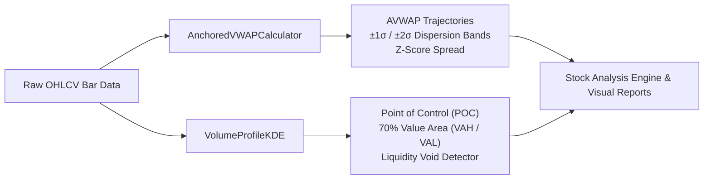

# Institutional Microstructure: Anchored VWAP & Volume Profile (KDE)

`qlib.contrib.microstructure` provides institutional order-flow and liquidity analytics designed to overcome the limitations of sterile daily price bars in traditional quantitative machine learning models.

---

## Architecture Overview



---

## 1. Anchored VWAP Engine (`anchored_vwap.py`)

### Mathematical Formulation
Given an anchor date $t_0$, typical price $P_\tau = \frac{\text{High}_\tau + \text{Low}_\tau + \text{Close}_\tau}{3}$, and volume $V_\tau$:

$$\text{AVWAP}_{t_0, t} = \frac{\sum_{\tau=t_0}^t P_\tau \cdot V_\tau}{\sum_{\tau=t_0}^t V_\tau}$$

### Volume-Weighted Variance & Standard Deviation Bands
$$\sigma_{\text{AVWAP}, t}^2 = \frac{\sum_{\tau=t_0}^t V_\tau \cdot (P_\tau - \text{AVWAP}_{t_0, t})^2}{\sum_{\tau=t_0}^t V_\tau}$$

$$\text{Upper Band}_k = \text{AVWAP}_t + k \cdot \sigma_{\text{AVWAP}, t}, \quad \text{Lower Band}_k = \text{AVWAP}_t - k \cdot \sigma_{\text{AVWAP}, t} \quad (k \in \{1, 2\})$$

### Standardized Z-Score Price Spread
$$Z_{\text{AVWAP}, t} = \frac{P_t - \text{AVWAP}_{t_0, t}}{\sigma_{\text{AVWAP}, t}}$$

* $Z \approx 0$: Institutional fair value / liquidity magnet.
* $Z > +2.0$: Extended overbought (mean-reversion pullback risk).
* $Z < -1.5$: Institutional accumulation / dip-buying zone.

### Supported Anchors
- **`YTD`**: First trading session of the calendar year.
- **`QTD`**: First trading session of the calendar quarter.
- **`52W High`**: Rolling 252-day cyclical peak (overhead supply memory).
- **`52W Low`**: Rolling 252-day cyclical trough (accumulated baseline support).
- **`Custom`**: Specific user-defined date string `YYYY-MM-DD`.

---

## 2. Volume Profile KDE Engine (`volume_profile.py`)

Replaces retail histogram binning with continuous **Volume-Weighted Gaussian Kernel Density Estimation (KDE)**:

$$\hat{f}(p) = \frac{1}{\sum_{i=1}^N V_i} \sum_{i=1}^N V_i \cdot \frac{1}{h \sqrt{2\pi}} \exp\left(-\frac{1}{2}\left(\frac{p - P_i}{h}\right)^2\right)$$

### Optimal Bandwidth ($h$)
Adapted Silverman's rule of thumb using volume-weighted price dispersion:
$$h = 1.06 \cdot \sigma_V \cdot N^{-1/5}$$

### Key Metrics
1. **Point of Control (POC)**: The global mode $\arg\max_p \hat{f}(p)$ where the maximum volume transacted.
2. **70% Value Area (VAH & VAL)**: The highest-density envelope integrating 70% of total volume mass.
3. **Low-Volume Nodes (LVN) / Liquidity Voids**: Thin-book air pockets where density drops below 20% of maximum. Stocks trading into liquidity voids experience high-velocity breakout expansions.

---

## 3. Usage Examples

### Python API
```python
from qlib.contrib.microstructure import compute_microstructure_features

# df is a pandas DataFrame with 'date', 'close', 'high', 'low', 'volume'
enriched_df, summary = compute_microstructure_features(df)

ytd_avwap = summary["avwap"]["ytd"]["value"]
ytd_zscore = summary["avwap"]["ytd"]["zscore"]
poc = summary["volume_profile"]["poc"]
in_void = summary["volume_profile"]["in_liquidity_void"]

print(f"YTD AVWAP: ${ytd_avwap:.2f} (Z: {ytd_zscore:+.2f}s)")
print(f"Volume Profile POC: ${poc:.2f} (In Liquidity Void: {in_void})")
```

### CLI Demonstration Script
```powershell
python examples/microstructure_avwap_profile.py --symbol SMH --data_dir D:\trading\qlib
```

### Full Visual Dashboard Generation
```powershell
python scripts/visualize_stock_analysis.py --symbol SMH --data_dir D:\trading\qlib
```

